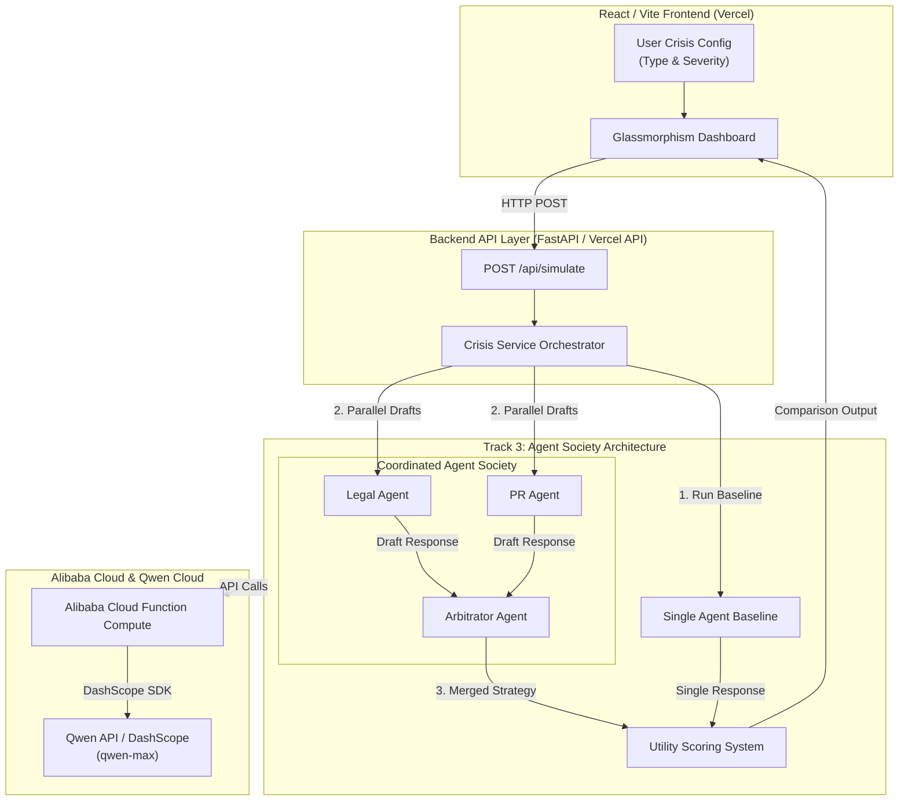

# 🛡️ Crisora
Agent Society for Enterprise Crisis Management

> **Global AI Hackathon Series with Qwen Cloud** | **Track 3: Agent Society**  
> *Asynchronous multi-agent boardroom negotiation system powered by Qwen Cloud and Alibaba Cloud Function Compute.*


🔗 **Live App:** [crisora-qwen.vercel.app](https://crisora-qwen.vercel.app/)  
📝 **Medium Deep-Dive:** [Read on Medium](https://medium.com/@harismirza3456/crisora-orchestrating-an-agent-society-for-enterprise-crisis-management-on-qwen-cloud-34b390cdd8f3)


A cinematic multi-agent crisis response simulator built with a Python Qwen backend and a React frontend.


# Architecture Diagram



### The 3-Phase Process
1. **Phase 1: Single-Agent Baseline** — Evaluates initial control performance.
2. **Phase 2: Adversarial Draft Generation** — Legal Council and PR Guardian run parallel drafts.
3. **Phase 3: Arbitrated Consensus** — The Arbitrator agent resolves conflicts, produces a unified strategy, and computes the utility delta.


## ⚡ Key Results (Baseline vs. Agent Society)

| Metric | Single-Agent Baseline | Crisora Agent Society | Net Lift (Delta) |
| :--- | :--- | :--- | :--- |
| **Strategy Utility Score** | 90% | **100%** | **+10% Gain** |
| **Consensus Status** | N/A (Single Output) | **RESOLVED** | Multi-Agent Alignment |
| **Strategy Quality** | Lukewarm Compromise | Legal Safeguards + PR Empathy | Superior |


## 📌 Problem Statement

When a corporate crisis hits—whether it's a 100k-record data breach or a cloud outage—**Legal** and **PR** teams have fundamentally opposing goals:
* **Legal:** Cold, risk-averse, focused on liability defense and minimal exposure.
* **PR:** Empathetic, transparent, focused on customer trust and brand preservation.

A single-prompt LLM tries to compromise between both, resulting in a generic, diluted response that satisfies neither side. **Crisora** solves this by deploying a specialized multi-agent boardroom negotiation society.

### 🌟 Key Features

* **Asynchronous Multi-Agent Negotiation Pipeline:** Orchestrates specialized Legal, PR, and Arbitrator agents running concurrently to simulate real boardroom conflict resolution.
* **Powered by `qwen-max` on DashScope:** Utilizes Alibaba Cloud's flagship reasoning model to perform high-stakes policy synthesis and quantitative utility scoring.
* **Serverless Execution via Alibaba Cloud Function Compute (FC):** Decoupled microservice architecture engineered for ultra-low latency parallel agent execution.
* **Glassmorphism Analytics Dashboard:** Modern React/Vite UI displaying live state transitions, real-time agent thought streams, and baseline-vs-society performance metrics.
* **Automated Conflict Resolution:** Explicitly outputs consensus state tracking (`RESOLVED` vs. `RENEGOTIATE`) to guarantee alignment before output generation.

## Tech Stack
- **LLM Engine:** `qwen-max` via Alibaba Cloud DashScope
- **Serverless Execution:** Alibaba Cloud Function Compute (FC)
- **Backend API:** Python 3.14+ / FastAPI
- **Frontend:** React 18 / Vite (Glassmorphism Dashboard)

## Project Structure

```text
.
├── agent.py              # Qwen client and agent prompt definitions
├── app.py                # Local FastAPI backend entrypoint
├── api/
│   └── index.py          # Vercel Python API entrypoint
├── crisis_service.py     # Shared simulation / orchestration logic
├── frontend/
│   ├── src/
│   │   ├── App.jsx       # React UI
│   │   └── styles.css    # UI styling
│   ├── package.json      # Frontend scripts and dependencies
│   └── vite.config.js    # Vite config with local API proxy
├── requirements.txt      # Python dependencies
├── vercel.json           # Vercel build and function config
└── .env.example          # Example environment variables
```

## Prerequisites

- Python 3.14 or newer
- Node.js 18 or newer
- A Qwen / DashScope API key

## Environment Variables

Create a `.env` file in the project root.

```env
DASHSCOPE_API_KEY=your_api_key_here
# or
QWEN_API_KEY=your_api_key_here

# Optional
QWEN_MODEL=qwen-max
QWEN_BASE_URL=https://dashscope-intl.aliyuncs.com/compatible-mode/v1
QWEN_REQUEST_TIMEOUT=20
```

The app will also accept `OPENAI_API_KEY`, `OPENAI_BASE_URL`, and `OPENAI_MODEL` if you are using a compatible endpoint.

## Local Development

### 1. Start the Python backend

From the project root:

```bash
python app.py
```

The backend runs on `http://localhost:8000`.

### 2. Start the React frontend

In a second terminal:

```bash
cd frontend
npm install
npm run dev
```

The frontend runs on `http://localhost:5173` and proxies API requests to `http://localhost:8000`.

### 3. Open the app

Open the Vite URL shown in the terminal, usually:

```text
http://localhost:5173
```

## Build the Frontend

To produce a production build locally:

```bash
cd frontend
npm run build
```

The static output is written to `frontend/dist`.

## API Endpoints

### `GET /api/meta`
Returns the available crisis scenarios and basic metadata.

### `POST /api/simulate`
Runs the full agent simulation.

Example payload:

```json
{
  "crisis_type": "Data Breach (100k User Records Exposed)",
  "severity": 8
}
```

---

Thank you for reading..
<br/>
Haris :)