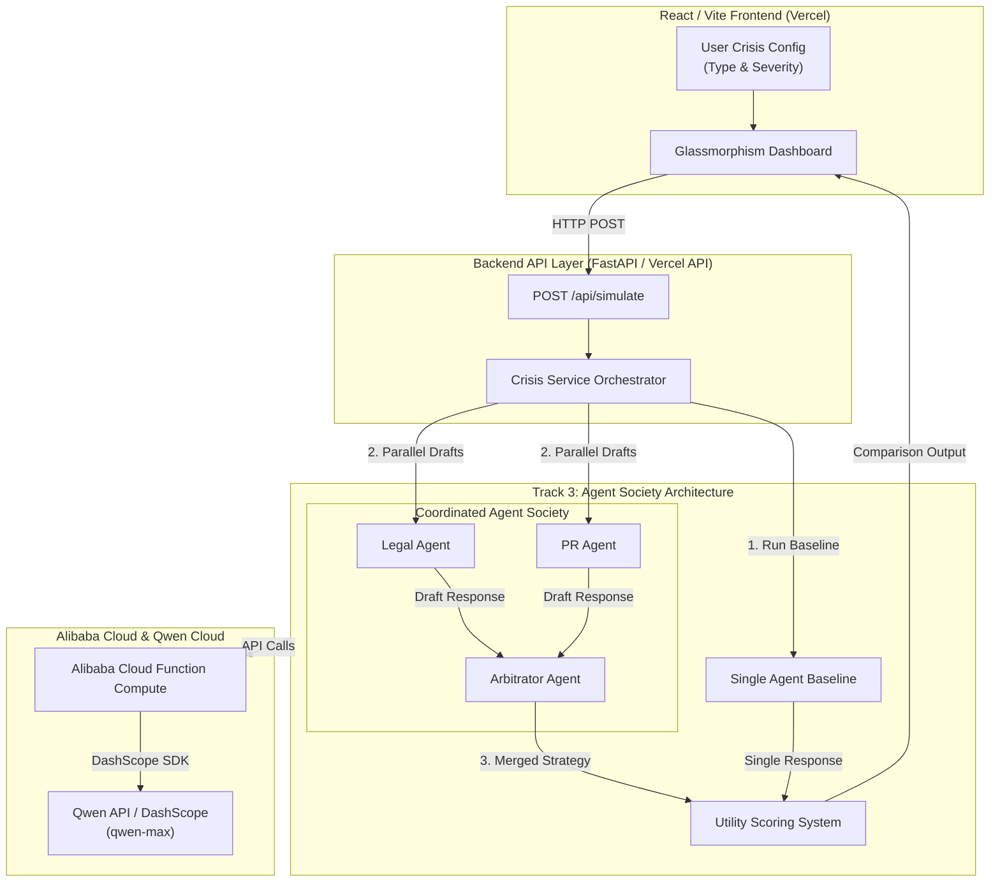

# Crisora

A cinematic multi-agent crisis response simulator built with a Python Qwen backend and a React frontend.

The app compares a single-agent baseline against a coordinated agent society made up of Legal, PR, and Arbitrator roles. The UI is built in React, while the model/agent logic stays in Python.


# Architecture Diagram



## Features

- Modern React dashboard with a polished glassmorphism UI
- Qwen-powered legal, PR, and arbitrator agents
- Parallel agent execution for Legal and PR drafts
- Final arbitration step that merges the competing responses
- Simple utility scoring to compare baseline vs coordinated output
- Local development setup for backend and frontend
- Vercel deployment path for the React app and Python API

## Tech Stack

- Python 3.14+
- FastAPI
- OpenAI-compatible Qwen client
- React 18
- Vite
- Vercel Python Functions

## Project Structure

```text
.
├── agent.py              # Qwen client and agent prompt definitions
├── app.py                # Local FastAPI backend entrypoint
├── api/
│   └── index.py          # Vercel Python API entrypoint
├── crisis_service.py     # Shared simulation / orchestration logic
├── frontend/
│   ├── src/
│   │   ├── App.jsx       # React UI
│   │   └── styles.css    # UI styling
│   ├── package.json      # Frontend scripts and dependencies
│   └── vite.config.js    # Vite config with local API proxy
├── requirements.txt      # Python dependencies
├── vercel.json           # Vercel build and function config
└── .env.example          # Example environment variables
```

## Prerequisites

- Python 3.14 or newer
- Node.js 18 or newer
- A Qwen / DashScope API key

## Environment Variables

Create a `.env` file in the project root.

```env
DASHSCOPE_API_KEY=your_api_key_here
# or
QWEN_API_KEY=your_api_key_here

# Optional
QWEN_MODEL=qwen-max
QWEN_BASE_URL=https://dashscope-intl.aliyuncs.com/compatible-mode/v1
QWEN_REQUEST_TIMEOUT=20
```

The app will also accept `OPENAI_API_KEY`, `OPENAI_BASE_URL`, and `OPENAI_MODEL` if you are using a compatible endpoint.

## Local Development

### 1. Start the Python backend

From the project root:

```bash
python app.py
```

The backend runs on `http://localhost:8000`.

### 2. Start the React frontend

In a second terminal:

```bash
cd frontend
npm install
npm run dev
```

The frontend runs on `http://localhost:5173` and proxies API requests to `http://localhost:8000`.

### 3. Open the app

Open the Vite URL shown in the terminal, usually:

```text
http://localhost:5173
```

## Build the Frontend

To produce a production build locally:

```bash
cd frontend
npm run build
```

The static output is written to `frontend/dist`.

## API Endpoints

### `GET /api/meta`
Returns the available crisis scenarios and basic metadata.

### `POST /api/simulate`
Runs the full agent simulation.

Example payload:

```json
{
  "crisis_type": "Data Breach (100k User Records Exposed)",
  "severity": 8
}
```

## Deploying to Vercel

This project is already configured for Vercel with [vercel.json](vercel.json).

### Recommended deployment steps

1. Push this repository to GitHub.
2. Create a new Vercel project and import the repo.
3. Leave the project root at the repository root.
4. Add your environment variables in the Vercel dashboard.
5. Deploy.

Vercel will:

- Build the frontend from `frontend/`
- Serve the compiled React app from `frontend/dist`
- Run the Python API from `api/index.py`

### Vercel environment variables

Set the same secrets in Vercel that you use locally:

- `DASHSCOPE_API_KEY` or `QWEN_API_KEY`
- `QWEN_MODEL` if you want to override the default model
- `QWEN_BASE_URL` if you are using a custom compatible endpoint
- `QWEN_REQUEST_TIMEOUT` if you need a different timeout

## Notes

- `app.py` is the local FastAPI entrypoint.
- `api/index.py` is the Vercel function entrypoint.
- The UI uses relative `/api/...` requests, so it works locally with the Vite proxy and on Vercel without code changes.

## Troubleshooting

- If the frontend shows an API error, make sure the backend is running and your `.env` file contains a valid Qwen key.
- If Vercel deployment fails, verify that the env vars are set in the Vercel project settings.
- If the build cannot find the backend dependencies, reinstall them with `pip install -r requirements.txt`.


---

Haris :)